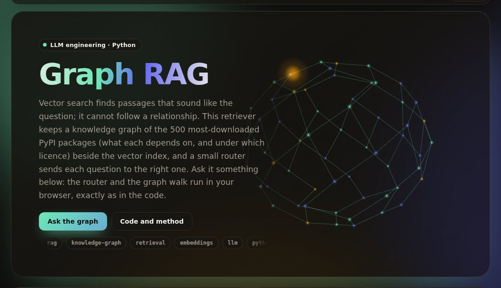

# graph-rag

[](https://github.com/umer-78/graph-rag/actions/workflows/ci.yml)

[](https://umer-78.github.io/graph-rag/)

**Live demo:** https://umer-78.github.io/graph-rag/ (ask about PyPI dependencies; the router and graph walk run in your browser)

Retrieval for questions that need two or three hops across related things, where vector search fails because the second hop's text looks nothing like the question.

The corpus is the 500 most-downloaded Python packages, with their PyPI records as documents: summaries and descriptions. It is built from the same chunks two ways:

- **A knowledge graph.** The ontology is constrained: Package, Maintainer, License; DEPENDS_ON, MAINTAINED_BY, LICENSED_AS.
  - Entity resolution uses PEP 503 names for packages and a table for licence spellings, with every spelling kept as an alias.
  - Writes are idempotent upserts.
  - Every edge cites the chunk that justifies it.
- **A vector index.** bge-small embeddings of the same chunk ids.

A router sends relationship questions (dependencies, what depends on a package, their licences or maintainers, what two packages share) to the graph, and single-fact questions to the vectors. When a question names no package, it goes to the vectors.

## Results

`python -m graphrag bench`, about 90 seconds (it embeds the descriptions).

- **Graph built:** 500 packages, 311 maintainers and 46 licences; 1,051 dependency edges, 495 licence edges and 479 maintainer edges.
- **Entity resolution:** 1,112 of 1,231 runtime-dependency mentions resolve to a package in the corpus with PEP 503 names, against 1,042 with names as written. `requires_dist` says `charset_normalizer` where the project is `charset-normalizer`.
- **Idempotent:** ingesting twice leaves the graph unchanged.

The table shows recall@10: the share of the packages a question needs that were retrieved, out of at most 10. There are 360 questions generated from the graph, 60 per kind, in several phrasings.

| Question kind | Router correct | Vector | Routed | Both merged |
|---|---|---|---|---|
| a fact about a named package ("What is urllib3 used for?") | 100% | 98.3% | 98.3% | 100.0% |
| its dependencies ("What does requests depend on?") | 100% | 22.3% | 100.0% | 100.0% |
| what depends on it ("Which libraries are built on urllib3?") | 100% | 15.3% | 100.0% | 100.0% |
| its dependencies' licences | 100% | 13.7% | 100.0% | 100.0% |
| its dependencies' maintainers | 100% | 18.0% | 100.0% | 100.0% |
| what two packages share | 100% | 62.0% | 100.0% | 100.0% |
| **all** | 100% | **38.3%** | **99.7%** | 100.0% |

- **Vector search is fine on single facts (98%) and fails on the hops (14–22%).** "Who maintains the packages that cyclopts depends on?" shares nothing with the text of `rich` or `attrs`.
- **For relationship questions the graph gives the answer itself, with a citation for each edge.** For "What licences do the packages cyclopts needs use?": attrs — MIT, docstring-parser — MIT, rich — MIT, rich-rst — MIT (each from `package:<name>#0`).

**What these numbers don't show.** The questions are generated from the graph, so the graph path is near-perfect by construction. The router is a rule set, and 100% on templated phrasings says little about free-form questions; the LLM router the spec describes would go here. What the benchmark does measure is the vector path's blind spot on hops, and how much entity resolution recovers.

## How it works

```python
from graphrag import data
from graphrag.embed import Embedder
from graphrag.graph import Graph
from graphrag.retrieve import Retriever

g = Graph("graph.db")
g.ingest(data.records())                           # upserts: safe to rerun
r = Retriever(g, Embedder())
r.route("Which libraries are built on urllib3?")   # ('graph', 'dependents')
r.retrieve("Which libraries are built on urllib3?")
r.answer("Who maintains the packages that requests depends on?")
```

- `graphrag/graph.py`: the ontology, entity resolution, the SQLite store (nodes, aliases, edges with source chunks, chunks).
- `graphrag/retrieve.py`: the vector and graph paths, the router (with the named package's position deciding "depends on X" from "X depends on"), and graph answers.
- `graphrag/bench.py`: the question generator and the measurements.

```bash
pip install -e '.[dev]'
pytest -q
python -m graphrag bench
python -m graphrag.demo    # rebuild the live demo's data in docs/
```

The package list, PyPI records and bge-small (pinned by SHA-256) are downloaded on first use into `~/.cache/graphrag`, which pins the corpus to the day it was fetched; nothing is committed.
